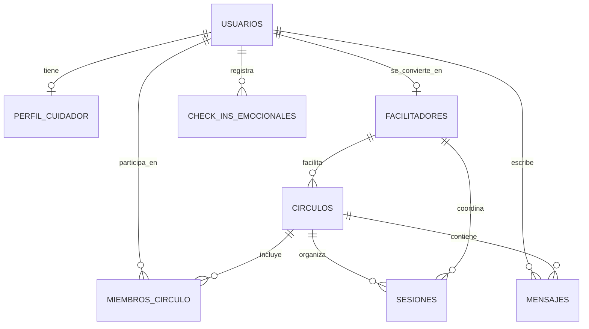

# Esquema de base de datos — Círculos de Cuidado

Este documento define el esquema relacional inicial para la plataforma, pensado para PostgreSQL 16 y Prisma 6. El diseño prioriza privacidad, trazabilidad y escalabilidad incremental para los módulos de cuidado, círculos y sesiones.

## 1. Principios del diseño

- Usar UUIDs como identificadores primarios para facilitar migraciones y evitar dependencias de auto-incrementales.
- Incluir columnas de auditoría en todas las tablas: `created_at`, `updated_at` y, cuando aplique, `deleted_at`.
- Mantener un modelo relacional claro para usuarios, perfiles, círculos, sesiones, mensajes y check-ins emocionales.
- Separar datos sensibles de los datos operativos para facilitar futuras políticas de anonimización y privacidad.
- Evitar duplicación de información entre entidades; usar claves foráneas y tablas de relación cuando corresponda.

## 2. Entidades principales

### usuarios

Representa a cualquier persona registrada en la plataforma.

| Campo | Tipo | Obligatorio | Descripción |
| --- | --- | --- | --- |
| id | UUID | Sí | Identificador único del usuario. |
| email | VARCHAR(255) | Sí | Email principal y login. |
| password_hash | VARCHAR(255) | No | Hash bcrypt para autenticación local. |
| nombre_real | VARCHAR(255) | No | Nombre del usuario en la plataforma. |
| nombre_visible | VARCHAR(255) | No | Nombre que se muestra públicamente. |
| avatar_url | TEXT | No | URL del avatar. |
| rol | VARCHAR(20) | Sí | `cuidador`, `facilitador`, `admin`. |
| email_verificado | BOOLEAN | Sí | Indica si el email fue verificado. |
| anonimo | BOOLEAN | Sí | Permite ocultar identidad en ciertos contextos. |
| oauth_provider | VARCHAR(50) | No | `google`, `github` o `local`. |
| oauth_id | VARCHAR(255) | No | Identificador externo del proveedor OAuth. |
| created_at | TIMESTAMP | Sí | Fecha de creación. |
| updated_at | TIMESTAMP | Sí | Fecha de última actualización. |
| deleted_at | TIMESTAMP | No | Soft delete. |

### perfil_cuidador

Datos del cuidador que ayudan a construir compatibilidad de círculos y matching.

| Campo | Tipo | Obligatorio | Descripción |
| --- | --- | --- | --- |
| id | UUID | Sí | Identificador del perfil. |
| usuario_id | UUID | Sí | FK a `usuarios.id`. |
| edad | INTEGER | No | Edad aproximada del cuidador. |
| enfermedad_principal | VARCHAR(255) | No | Enfermedad o diagnóstico principal. |
| fase_cuidado | VARCHAR(50) | No | `inicial`, `intermedio`, `avanzado`. |
| disponibilidad_horaria | JSONB | No | Rangos de disponibilidad. |
| idioma | VARCHAR(50) | No | Idioma preferido. |
| ubicacion | VARCHAR(255) | No | Región o ciudad. |
| urgencia | INTEGER | No | Valor de urgencia para matching. |
| notas | TEXT | No | Información contextual relevante. |
| created_at | TIMESTAMP | Sí | Fecha de creación. |
| updated_at | TIMESTAMP | Sí | Fecha de última actualización. |

### facilitadores

Perfil de personas que acompañan los círculos como facilitadores.

| Campo | Tipo | Obligatorio | Descripción |
| --- | --- | --- | --- |
| id | UUID | Sí | Identificador del facilitador. |
| usuario_id | UUID | Sí | FK a `usuarios.id`. |
| experiencia_years | INTEGER | No | Años de experiencia. |
| especialidades | JSONB | No | Especialidades o temáticas. |
| certificaciones | JSONB | No | Certificaciones y formaciones. |
| disponibilidad | JSONB | No | Días y franjas disponibles. |
| calificacion_promedio | DECIMAL(3,2) | No | Promedio de valoración. |
| activo | BOOLEAN | Sí | Indica si está disponible para asignaciones. |
| created_at | TIMESTAMP | Sí | Fecha de creación. |
| updated_at | TIMESTAMP | Sí | Fecha de última actualización. |

### circulos

Grupos de apoyo o acompañamiento.

| Campo | Tipo | Obligatorio | Descripción |
| --- | --- | --- | --- |
| id | UUID | Sí | Identificador del círculo. |
| nombre | VARCHAR(255) | Sí | Nombre del círculo. |
| tema | VARCHAR(255) | No | Tema central del grupo. |
| descripcion | TEXT | No | Descripción general. |
| facilitador_id | UUID | No | FK a `facilitadores.id`. |
| capacidad_minima | INTEGER | Sí | Número mínimo de personas. |
| capacidad_maxima | INTEGER | Sí | Número máximo de personas. |
| estado | VARCHAR(20) | Sí | `activo`, `pausado`, `cerrado`. |
| created_at | TIMESTAMP | Sí | Fecha de creación. |
| updated_at | TIMESTAMP | Sí | Fecha de última actualización. |

### miembros_circulo

Tabla de relación entre usuarios y círculos.

| Campo | Tipo | Obligatorio | Descripción |
| --- | --- | --- | --- |
| id | UUID | Sí | Identificador único. |
| circulo_id | UUID | Sí | FK a `circulos.id`. |
| usuario_id | UUID | Sí | FK a `usuarios.id`. |
| rol | VARCHAR(20) | Sí | `participante`, `oyente`, `admin`. |
| estado | VARCHAR(20) | Sí | `activo`, `invitado`, `salido`. |
| fecha_ingreso | TIMESTAMP | No | Fecha de ingreso. |
| fecha_salida | TIMESTAMP | No | Fecha de salida. |
| created_at | TIMESTAMP | Sí | Fecha de creación. |
| updated_at | TIMESTAMP | Sí | Fecha de última actualización. |

### sesiones

Reuniones o encuentros del círculo.

| Campo | Tipo | Obligatorio | Descripción |
| --- | --- | --- | --- |
| id | UUID | Sí | Identificador único. |
| circulo_id | UUID | Sí | FK a `circulos.id`. |
| facilitador_id | UUID | No | FK a `facilitadores.id`. |
| titulo | VARCHAR(255) | Sí | Título de la sesión. |
| fecha_programada | TIMESTAMP | Sí | Fecha y hora de la sesión. |
| duracion_minutos | INTEGER | Sí | Duración esperada. |
| tipo | VARCHAR(20) | Sí | `video`, `chat`, `mixta`. |
| estado | VARCHAR(20) | Sí | `programada`, `en_curso`, `finalizada`, `cancelada`. |
| enlace_reunion | TEXT | No | Enlace a la sala de reunión. |
| notas | TEXT | No | Notas del facilitador. |
| created_at | TIMESTAMP | Sí | Fecha de creación. |
| updated_at | TIMESTAMP | Sí | Fecha de última actualización. |

### mensajes

Mensajes del chat asíncrono del círculo.

| Campo | Tipo | Obligatorio | Descripción |
| --- | --- | --- | --- |
| id | UUID | Sí | Identificador único. |
| circulo_id | UUID | Sí | FK a `circulos.id`. |
| usuario_id | UUID | Sí | FK a `usuarios.id`. |
| contenido | TEXT | Sí | Cuerpo del mensaje. |
| tipo | VARCHAR(20) | Sí | `texto`, `imagen`, `archivo`. |
| reply_to_id | UUID | No | FK a `mensajes.id` para respuestas. |
| created_at | TIMESTAMP | Sí | Fecha de creación. |
| updated_at | TIMESTAMP | Sí | Fecha de última actualización. |
| deleted_at | TIMESTAMP | No | Eliminación lógica. |

### check_ins_emocionales

Registros diarios de bienestar emocional.

| Campo | Tipo | Obligatorio | Descripción |
| --- | --- | --- | --- |
| id | UUID | Sí | Identificador único. |
| usuario_id | UUID | Sí | FK a `usuarios.id`. |
| pregunta | VARCHAR(255) | Sí | Pregunta del día. |
| escala | INTEGER | Sí | Valor de 1 a 10. |
| nota | TEXT | No | Comentario opcional. |
| respondido_en | TIMESTAMP | Sí | Momento de respuesta. |
| created_at | TIMESTAMP | Sí | Fecha de creación. |

## 3. Relaciones clave

- Un `usuario` puede tener un único `perfil_cuidador` y opcionalmente un `facilitador`.
- Un `circulo` tiene un `facilitador` asignado y muchos `miembros_circulo`.
- Un `miembro_circulo` conecta un `usuario` con un `circulo`.
- Una `sesion` pertenece a un `circulo` y puede tener un `facilitador` asignado.
- Un `mensaje` pertenece a un `circulo` y a un `usuario`.
- Un `check_in_emocional` pertenece a un `usuario`.

## 4. Diagrama relacional

## 5. Recomendaciones de implementación

- Para el backend, este esquema puede implementarse con Prisma usando modelos con nombres en singular y tablas en snake_case.
- Para consultas de matching, conviene mantener `perfil_cuidador` y `circulos` con campos indexados por `ubicacion`, `urgencia` y `estado`.
- Para privacidad, los campos sensibles deben tratarse con cifrado o minimización de datos en futuras iteraciones.
- Para observabilidad, conviene agregar tablas de auditoría o eventos en una fase posterior, sin bloquear la primera migración.
